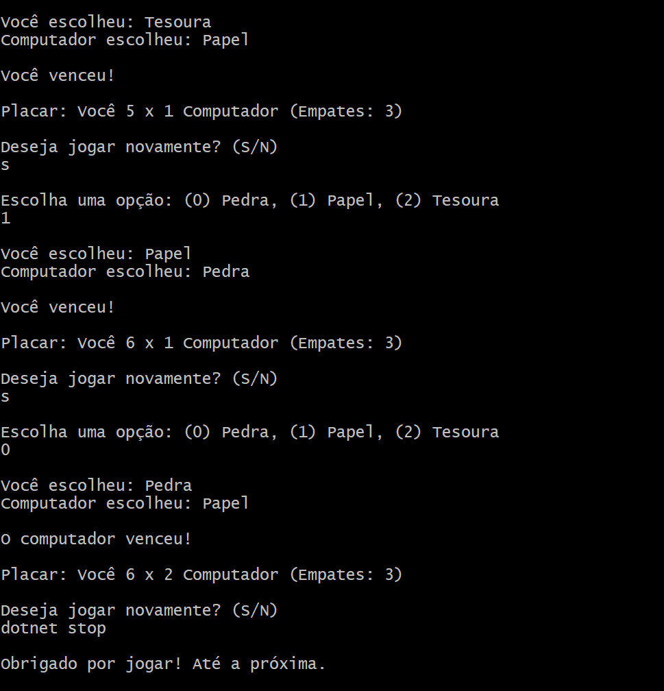

# Pedra Papel e Tesoura

Claro! Vou explicar o código de uma forma simples, para que mesmo quem não tem muita experiência em programação consiga entender.

### O que o programa faz:
Este é um jogo de "Pedra, Papel, Tesoura", onde você joga contra o computador. Você escolhe uma das três opções (pedra, papel ou tesoura), e o computador faz o mesmo. Depois, o programa compara as escolhas e mostra quem ganhou, se houve empate, e permite jogar várias rodadas.

### Explicação passo a passo:

1. **Escolha do jogador**:
   - O programa pede para você escolher entre as opções "Pedra", "Papel" ou "Tesoura" digitando o número correspondente: 
     - `0` para Pedra,
     - `1` para Papel,
     - `2` para Tesoura.
   - Se você digitar um valor que não seja 0, 1 ou 2, ele vai pedir novamente até você escolher uma opção válida.

2. **Escolha do computador**:
   - O computador também faz uma escolha, mas ele decide de forma aleatória.
   - No código, usamos uma função que gera um número aleatório entre 0 e 99 (como se fosse um dado de 100 lados).
   - Dependendo desse número, o computador escolhe:
     - Se o número for entre 0 e 32, o computador escolhe uma jogada que vai ganhar de você.
     - Se o número for entre 33 e 65, o computador escolhe a mesma jogada que você, resultando em um empate.
     - Se o número for entre 66 e 99, o computador escolhe uma jogada que vai perder para você.

   Isso cria um equilíbrio no jogo, dando uma chance aproximada de 33% para cada resultado: vitória sua, vitória do computador, ou empate.

3. **Comparação das escolhas**:
   - Depois que você e o computador escolheram, o programa compara as escolhas.
   - Se você e o computador escolherem a mesma coisa (exemplo: os dois escolhem "Pedra"), o jogo resulta em um empate.
   - Se o computador escolher algo que ganha de você (exemplo: você escolhe "Pedra" e o computador escolhe "Papel"), o computador vence.
   - Se você escolher algo que vence o computador (exemplo: você escolhe "Pedra" e o computador escolhe "Tesoura"), você ganha.

4. **Placar**:
   - A cada rodada, o programa mostra o placar, dizendo quantas vezes você ganhou, quantas vezes o computador ganhou e quantos empates aconteceram.

5. **Jogar novamente**:
   - Depois de cada rodada, o programa pergunta se você quer jogar de novo.
   - Se você digitar "S" (sim), o jogo reinicia e você pode jogar outra rodada.
   - Se você digitar "N" (não), o programa termina e agradece por você ter jogado.

### Em resumo:
- O programa te dá a oportunidade de escolher entre Pedra, Papel ou Tesoura.
- O computador também faz uma escolha, com chances balanceadas de ganhar, perder ou empatar.
- O resultado é mostrado, e você pode jogar várias vezes.
- O jogo é justo, com uma probabilidade de vitória, empate ou derrota quase igual para ambos.

Se tiver dúvidas sobre algum ponto específico, me avise que eu explico melhor!

